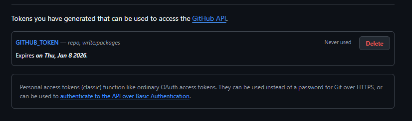

# Gym Management System

# TP1 – Mise en place d’un workflow Git professionnel + Husky (Vue / Nest / Postgres)

Créer la branche develop

git checkout -b develop main
git push -u origin develop


# Créer la branche de travail

git checkout -b feature/init-husky develop

Installer Husky (multi-packages)

Installer Husky à la racine

npm install --save-dev husky
npm pkg set scripts.prepare="husky install"
npm run prepare


# Créer le hook pre-commit

Ajouter dans .husky/pre-commit :

#!/bin/sh
. "$(dirname "$0")/_/husky.sh"

npm run lint:all


 Ajouter les scripts dans package.json racine

 ```bash
{
  "scripts": {
    "prepare": "husky install",
    "lint:front": "cd frontend && npm run lint",
    "lint:back": "cd backend && npm run lint",
    "lint:all": "npm run lint:front && npm run lint:back"
  }
}

 ```


# Mise en place de Commitlint

Installer Commitlint

npm install --save-dev @commitlint/config-conventional @commitlint/cli


Ajouter commitlint.config.js

module.exports = { extends: ["@commitlint/config-conventional"] };


# Créer le hook commit-msg

Ajouter dans .husky/commit-msg :

#!/bin/sh
. "$(dirname "$0")/_/husky.sh"

npx commitlint --edit "$1"


Installation Linter coté front et back avec des fichiers eslint.config.js 


### Installation Linter coté front et back avec des fichiers eslint.config.js 

backend :

```bash
export default [
  {
    languageOptions: {
      ecmaVersion: "latest",
      sourceType: "module",
      globals: {
        console: "readonly",
        process: "readonly",
        require: "readonly",
        module: "readonly"
      }
    },
    linterOptions: {
      reportUnusedDisableDirectives: "warn"
    },
    rules: {
      "no-unused-vars": "warn",
      "no-console": "off"
    },
    ignores: ["node_modules/**"]
  }
];

```

frontend :

```bash
import vuePlugin from "eslint-plugin-vue";

export default [
  {
    plugins: { vue: vuePlugin },
    languageOptions: {
      ecmaVersion: "latest",
      sourceType: "module",
      globals: {
        window: "readonly",
        document: "readonly",
        navigator: "readonly"
      }
    },
    linterOptions: {
      reportUnusedDisableDirectives: "warn"
    },
    rules: {
      "no-unused-vars": "warn",
      "no-console": "off",
      "vue/no-unused-components": "warn",
      "vue/html-self-closing": ["warn", {
        "html": { "void": "never", "normal": "never", "component": "always" },
        "svg": "always",
        "math": "always"
      }]
    },
    ignores: ["node_modules/**", "dist/**"]
  }
];


```

ci.yml

```bash
name: CI Pipeline

on:
  pull_request:
    branches:
      - develop
      - main

jobs:

  lint:
    runs-on: self-hosted
    steps:
      - uses: actions/checkout@v3

      - name: Clean frontend node_modules
        shell: powershell
        run: |
          Remove-Item -Recurse -Force frontend\node_modules -ErrorAction SilentlyContinue
          Remove-Item -Force frontend\package-lock.json -ErrorAction SilentlyContinue

      - name: Install frontend dependencies
        run: npm install --prefix frontend

      - name: Lint frontend
        run: npm run lint --prefix frontend

      - name: Clean backend node_modules
        shell: powershell
        run: |
          Remove-Item -Recurse -Force backend\node_modules -ErrorAction SilentlyContinue
          Remove-Item -Force backend\package-lock.json -ErrorAction SilentlyContinue

      - name: Install backend dependencies
        run: npm install --prefix backend

      - name: Lint backend
        run: npm run lint --prefix backend

  test:
    runs-on: self-hosted
    needs: lint
    steps:
      - uses: actions/checkout@v3

      - name: Clean backend node_modules
        shell: powershell
        run: |
          Remove-Item -Recurse -Force backend\node_modules -ErrorAction SilentlyContinue
          Remove-Item -Force backend\package-lock.json -ErrorAction SilentlyContinue

      - name: Install backend dependencies
        run: npm install --prefix backend

      - name: Run backend tests
        run: npm test --prefix backend

  sonarcloud:
    runs-on: self-hosted
    needs: test

    env:
      SONAR_TOKEN: ${{ secrets.SONAR_TOKEN }}

    steps:
      - name: Checkout repository
        uses: actions/checkout@v4

      - name: Setup Node.js
        uses: actions/setup-node@v4
        with:
          node-version: "20"

      - name: Install backend dependencies
        working-directory: backend
        run: npm install

      - name: Run SonarScanner (backend)
        working-directory: backend
        run: |
          & "C:\sonar\sonar-scanner-5.0.1.3006-windows\bin\sonar-scanner.bat" `
          -D"sonar.login=$env:SONAR_TOKEN"
```


Cela bloque les commits non conventionnels : 


Sinon les commits passent 


# Protection des branches


# TP2 – Intégration Continue (CI) : Build, Lint, Tests & SonarCloud (Vue / NestJS)

> Pré-requis : TP1 terminé (Husky, Commitlint, protections de branches OK)

---

## Objectifs
- Créer un pipeline CI complet pour le projet full-stack
- Exécuter la CI sur un **runner local**
- Automatiser : build, lint, tests
- Ajouter une analyse qualité SonarCloud avec Quality Gate
- Garantir PR 100% validées avant merge

---

## Partie 1 – Création de la branche feature CI

```bash
git checkout develop
git pull
git checkout -b feature/ci-pipeline 
```
## Partie 2 – Mise en place du runner


Une fois terminé , le runner est actif sur github


## Partie 3 – Pipeline CI (GitHub Actions)

 badge SonarCloud

 [](https://sonarcloud.io/summary/new_code?id=DorianTrd_devSecOps_tp)
 
 tableau de bord Sonar

 


 Quality Gate

  

 PR bloquée

 


PR Passe pour les pipelines mais mais pas Quality Gate ( version payante obligatoire)


Runner Local : 


# TP3 – Dockerisation et orchestration de l’application Vue + NestJS + Postgres

## Partie 1

Test local pour le back


Test local pour le front


Lancement du localhost : 


## Partie 2





<br><br><br><br><br>
A complete fullstack gym management application built with modern web technologies.

## Features

### User Features
- **User Dashboard**: View stats, billing, and recent bookings
- **Class Booking**: Book and cancel fitness classes
- **Subscription Management**: View subscription details and billing
- **Profile Management**: Update personal information

### Admin Features
- **Admin Dashboard**: Overview of gym statistics and revenue
- **User Management**: CRUD operations for users
- **Class Management**: Create, update, and delete fitness classes
- **Booking Management**: View and manage all bookings
- **Subscription Management**: Manage user subscriptions

### Business Logic
- **Capacity Management**: Classes have maximum capacity limits
- **Time Conflict Prevention**: Users cannot book overlapping classes
- **Cancellation Policy**: 2-hour cancellation policy (late cancellations become no-shows)
- **Billing System**: Dynamic pricing with no-show penalties
- **Subscription Types**: Standard (€30), Premium (€50), Student (€20)

## Tech Stack

### Backend
- **Node.js** with Express.js
- **Prisma** ORM with PostgreSQL
- **RESTful API** with proper error handling
- **MVC Architecture** with repositories pattern

### Frontend
- **Vue.js 3** with Composition API
- **Pinia** for state management
- **Vue Router** with navigation guards
- **Responsive CSS** styling

### DevOps
- **Docker** containerization
- **Docker Compose** for orchestration
- **PostgreSQL** database
- **Nginx** for frontend serving

## Quick Start

### Prerequisites
- Docker and Docker Compose
- Git

### Installation

1. **Clone the repository**
   ```bash
   git clone <repository-url>
   cd gym-management-system
   ```

2. **Set up environment variables**
   ```bash
   cp .env.example .env
   ```
   
   Edit `.env` file if needed (default values should work for development).

3. **Start the application**
   ```bash
   docker-compose up --build
   ```

4. **Access the application**
   - Frontend: http://localhost:8080
   - Backend API: http://localhost:3000
   - Database: localhost:5432

### Default Login Credentials

The application comes with seeded test data:

**Admin User:**
- Email: admin@gym.com
- Password: admin123
- Role: ADMIN

**Regular Users:**
- Email: john.doe@email.com
- Email: jane.smith@email.com  
- Email: mike.wilson@email.com
- Password: password123 (for all users)

## Project Structure

```
gym-management-system/
├── backend/
│   ├── src/
│   │   ├── controllers/     # Request handlers
│   │   ├── services/        # Business logic
│   │   ├── repositories/    # Data access layer
│   │   ├── routes/          # API routes
│   │   └── prisma/          # Database schema and client
│   ├── seed/                # Database seeding
│   └── Dockerfile
├── frontend/
│   ├── src/
│   │   ├── views/           # Vue components/pages
│   │   ├── services/        # API communication
│   │   ├── store/           # Pinia stores
│   │   └── router/          # Vue router
│   ├── Dockerfile
│   └── nginx.conf
└── docker-compose.yml
```

## API Endpoints

### Authentication
- `POST /api/auth/login` - User login

### Users
- `GET /api/users` - Get all users
- `GET /api/users/:id` - Get user by ID
- `POST /api/users` - Create user
- `PUT /api/users/:id` - Update user
- `DELETE /api/users/:id` - Delete user

### Classes
- `GET /api/classes` - Get all classes
- `GET /api/classes/:id` - Get class by ID
- `POST /api/classes` - Create class
- `PUT /api/classes/:id` - Update class
- `DELETE /api/classes/:id` - Delete class

### Bookings
- `GET /api/bookings` - Get all bookings
- `GET /api/bookings/user/:userId` - Get user bookings
- `POST /api/bookings` - Create booking
- `PUT /api/bookings/:id/cancel` - Cancel booking
- `DELETE /api/bookings/:id` - Delete booking

### Subscriptions
- `GET /api/subscriptions` - Get all subscriptions
- `GET /api/subscriptions/user/:userId` - Get user subscription
- `POST /api/subscriptions` - Create subscription
- `PUT /api/subscriptions/:id` - Update subscription

### Dashboard
- `GET /api/dashboard/user/:userId` - Get user dashboard
- `GET /api/dashboard/admin` - Get admin dashboard

## Development

### Local Development Setup

1. **Backend Development**
   ```bash
   cd backend
   npm install
   npm run dev
   ```

2. **Frontend Development**
   ```bash
   cd frontend
   npm install
   npm run dev
   ```

3. **Database Setup**
   ```bash
   cd backend
   npx prisma migrate dev
   npm run seed
   ```

### Database Management

- **View Database**: `npx prisma studio`
- **Reset Database**: `npx prisma db reset`
- **Generate Client**: `npx prisma generate`
- **Run Migrations**: `npx prisma migrate deploy`

### Useful Commands

```bash
# Stop all containers
docker-compose down

# View logs
docker-compose logs -f [service-name]

# Rebuild specific service
docker-compose up --build [service-name]

# Access database
docker exec -it gym_db psql -U postgres -d gym_management
```

## Features in Detail

### Subscription System
- **STANDARD**: €30/month, €5 per no-show
- **PREMIUM**: €50/month, €3 per no-show  
- **ETUDIANT**: €20/month, €7 per no-show

### Booking Rules
- Users can only book future classes
- Maximum capacity per class is enforced
- No double-booking at the same time slot
- 2-hour cancellation policy

### Admin Dashboard
- Total users and active subscriptions
- Booking statistics (confirmed, no-show, cancelled)
- Monthly revenue calculations
- User management tools

### User Dashboard
- Personal statistics and activity
- Current subscription details
- Monthly billing with no-show penalties
- Recent booking history

## Contributing

1. Fork the repository
2. Create a feature branch
3. Make your changes
4. Add tests if applicable
5. Submit a pull request

## License

This project is licensed under the MIT License.

## Support

For support or questions, please open an issue in the repository.
